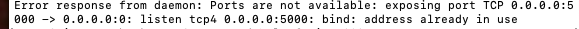

# CrytoBoard
# Docker 
## build image and start service
    docker-compose up --build
## stop and remove container
    docker-compose down
## possible error
If you encounter something like the image below, this indicate the host machine’s port specify in the docker-compose.yaml is being used. Here, ports:- "5001:5000", the 5001 is the host machine’s port. We can solve this problem by use a different port or free the host port. For example, this error appear because I use ports:- "5000:5000" for backend but 5000 is occupied, so I change it to ports:- "5001:5000". The frontend ports error can solved by the same methods for the backend. 

When you change the backend port, the 
    const host = "http://127.0.0.1:5001/" #line22 in CrytoBoard/frontend/src/Price/Price.tsx
need to be changed accordingly.

## access the web
http://localhost:8080

# backend: Python Flask

    python3 -m venv .venv

    . .venv/bin/activate

    pip install Flask flask_pymongo apscheduler requests

    pip install numpy

    python main.py

# frontend: TypeScript React

### `npm start`

Runs the app in the development mode.\
Open [http://localhost:3000](http://localhost:3000) to view it in the browser.

The page will reload if you make edits.\
You will also see any lint errors in the console.

### `npm test`

Launches the test runner in the interactive watch mode.\
See the section about [running tests](https://facebook.github.io/create-react-app/docs/running-tests) for more information.

### `npm run build`

Builds the app for production to the `build` folder.\
It correctly bundles React in production mode and optimizes the build for the best performance.

The build is minified and the filenames include the hashes.\
Your app is ready to be deployed!

See the section about [deployment](https://facebook.github.io/create-react-app/docs/deployment) for more information.

### `npm run eject`

**Note: this is a one-way operation. Once you `eject`, you can’t go back!**

If you aren’t satisfied with the build tool and configuration choices, you can `eject` at any time. This command will remove the single build dependency from your project.

Instead, it will copy all the configuration files and the transitive dependencies (webpack, Babel, ESLint, etc) right into your project so you have full control over them. All of the commands except `eject` will still work, but they will point to the copied scripts so you can tweak them. At this point you’re on your own.

You don’t have to ever use `eject`. The curated feature set is suitable for small and middle deployments, and you shouldn’t feel obligated to use this feature. However we understand that this tool wouldn’t be useful if you couldn’t customize it when you are ready for it.

